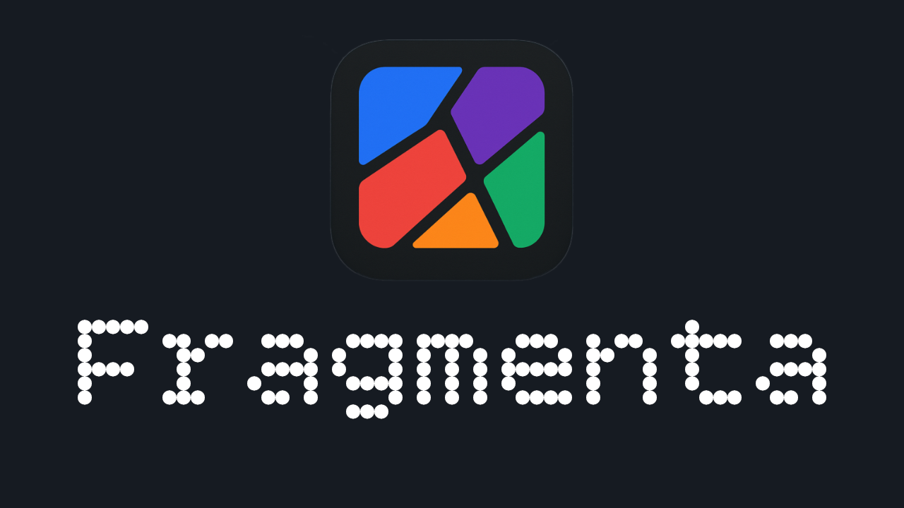

<div align="center">

# Fragmenta Desktop

[](https://opensource.org/licenses/Apache-2.0)
[](https://github.com/MAz-Codes/fragmenta/releases)
[](https://github.com/MAz-Codes/fragmenta)
[](https://www.misaghazimi.com/fragmenta)
[](https://www.python.org/)
[](https://pytorch.org/)



</div>

Fragmenta is an open-source desktop application for fine-tuning and generation using Stable Audio Open models. Think of this project as a ComfyUI for text-to-audio. You can definetly use it only as a user-friendly interface for inference but fine-tuning is made easy here to personlize the models. 

Please note that this is not a comemrcial software made for creating high-fidelity songs or samples. Fragmenta is an open-source pipeline, created to facilitate the integration of personalized GenAI technology within the musical workflow for musicians and compsoers without the need for coding or knwoledge of machine learning. It is therefore more suitable for experimental music and sonic arts applciations. This approach corresponds to my "Bending the Algorithm" approach that seeks artist-first approaches in AI technology. For more: https://www.misaghazimi.com

## Features

- PyQt6 desktop interface with embedded React frontend
- Audio file processing with automatic dataset creation
- Guided model download and HuggingFace authorization
- Model fine-tuning, saving and unwrapping
- Text-to-audio generation
- Real-time GPU memory monitoring

## Quick Start

Please read the following carefully:

- Even though Fragmenta will run on MacOS, I do not really recommend it. It is extremely slow (unless you have a lot of RAM). 
- If you want more coherent results, use the larger model.
- The initial installation can take a long time. Go make yourself a cup of coffee while that happens!
- This is an experimental one-person operation, fixes can take a while. With that said, enjoy making noises!

##

To get started, open your terminal and clone this repo:

```bash
# Clone repository
git clone https://github.com/MAz-Codes/fragmenta.git
cd Fragmenta
```
```bash
# Run application
./run.sh           # Linux
./run.bat            # Windows
./run.command      # MacOS
```

This will take a while, so be patient. The launcher script will:
- Install system dependencies (Qt libraries)
- Create Python 3.11 virtual environment
- Install PyTorch with CUDA support
- Install all required packages
- Launch the application

## Running After Initial Installation

After the first installation, simply go to the root folder and run ```main.py``` while venv is activated:

Linux:
```bash
cd Fragmenta
source venv/bin/activate
python main.py
```

Windows:
```bash
cd Fragmenta
venv\Scripts\activate
python main.py
```

MacOS:
```bash
cd Fragmenta
source venv/bin/activate
python main.py
```

## Project Structure

```
fragmenta/
├── app/
│   ├── backend/        # Flask API server
│   ├── frontend/       # React interface
│   ├── core/           # Core application logic
│   └── desktop/        # PyQt6 desktop wrapper
├── stable-audio-tools/ # Stable Audio library, slightly modified
├── models/             # Model configs and checkpoints
├── utils/              # Utility modules
├── config/             # Configuration files
└── main.py             # Application entry point
```

## Usage

### 0. Download the Models and Authenticate

The app will guide you in depth through downloading the models and authenticating with HF. You do not need both models. If you do not have a CUDA GPU, running the large model is NOT recommended. 

### 1. Process Audio Files

Upload audio files with text descriptions. The system will save audio and create training metadata.

### 2. Train Model

Configure training parameters:
- Base model: Stable Audio Open Small (341M) or 1.0 (838M)
- Epochs
- Batch size: 1-16
- Learning rate
- Checkpoint frequency

### 3. Generate Audio

Use base or fine-tuned models to generate audio from text prompts (1-47 seconds).

## API Endpoints

```
GET  /api/status                 System status
GET  /api/models                 List models
GET  /api/gpu-memory-status      GPU monitoring
POST /api/process-files          Process audio
POST /api/start-training         Start training
POST /api/stop-training          Stop training
GET  /api/training-status        Training progress
POST /api/generate               Generate audio
POST /api/unwrap-model           Unwrap checkpoint
POST /api/delete-checkpoint      Delete checkpoint
POST /api/start-fresh            Clear all data
POST /api/free-gpu-memory        Free GPU memory
```

## Development

You are more than welcome to make your own mods in front- and/or backend.

### Frontend Development

The React app App.js is located here:

```bash
cd app/frontend
npm run dev
```
If you make any changes, do not forget to build the app again before running the backend.

### Backend Development

The backend app.py is located in:
```bash
cd app/backend
```

**Always activate the virtual environment first:**

```bash
# Activate venv
source venv/bin/activate  # Linux/macOS
# OR
venv\Scripts\activate.bat  # Windows

# Then run backend
python app.py
```

## Troubleshooting

**Models do not Show After Downlaod:** You might need to restart the programm after downloading the mdoels. 

**Qt Platform Plugin Error**: Setup script auto-installs Qt libraries

**Flash-Attention Installation**: Optional dependency, app works without it, not available for Windows 

**GPU Memory Issues**: Use "Free GPU" button or reduce batch size

**Import Errors**: Verify Python 3.11 installation

## License

Copyright 2025 Misagh Azimi

This project is licensed under the Apache License 2.0 - see the [LICENSE](LICENSE) file for details.

### Third-Party Software

Fragmenta Desktop includes and depends on various third-party open-source software. For complete attribution and license information for all dependencies, see [NOTICE.md](NOTICE.md).

### Important Notes

- **PyQt6**: Used under GPL v3 license
- **Stable Audio Models**: Subject to Stability AI's model license terms (review when downloading)
- **stable-audio-tools**: MIT License (included in this repository with modifications)
