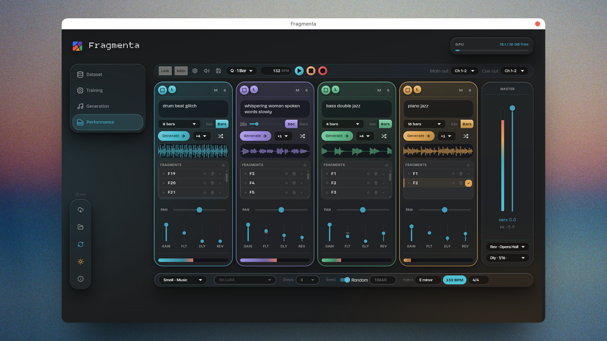

<div align="center">

# Fragmenta Desktop (beta)

[](https://opensource.org/licenses/Apache-2.0)
[](https://github.com/MAz-Codes/fragmenta/releases)
[](https://hub.docker.com/r/mazcode/fragmenta)
[](https://www.misaghazimi.com/fragmenta)
[](https://www.python.org/)
[](https://pytorch.org/)


**Open-source text-to-audio fine-tuning and generation for musicians.**

</div>

Fragmenta brings GenAI audio generation to musicians, offering intuitive fine-tuning and generation capabilities powered by [Stable Audio Open](https://huggingface.co/stabilityai/stable-audio-open-1.0) models.

This is not commercial software for creating high-fidelity songs or samples. Fragmenta is an open-source pipeline created to facilitate the integration of personalised GenAI technology within the musical workflow for musicians and composers — no coding or machine learning knowledge required. It is therefore more suitable for experimental music and sonic arts applications. This approach corresponds to my [Bending the Algorithm](https://www.misaghazimi.com) philosophy that seeks artist-first approaches in AI technology.

---

## Features

- **Desktop app** with a lightweight `pywebview` window and a pre-built React frontend — no Node.js or npm required
- **Docker images** for GPU and CPU — run as a web app on any machine
- **Bulk auto-annotation** — generate text prompts for your audio files via DSP analysis (Basic) or AI tagging with LAION-CLAP (Rich), with optional user-defined vocabulary
- **Fine-tuning** with configurable epochs, learning rate, batch size, checkpoint frequency, and precision
- **Text-to-audio generation** with CFG scale, inference steps, seed control, and batch generation
- **Performance Mode** — a 4-channel sampler designed for live performance:
  - Independent channel processing (gain, pan, low-pass filter, delay, reverb)
  - Master output with peak metering (dBFS)
  - **Bars-mode generation** — request clips by bar count; output is beat-aligned and tempo-locked to the master BPM
  - **Launch quantization** with an internal beat clock (works standalone or in sync with **Ableton Link**)
  - **Persistent session** — every panel setting survives page reloads and app restarts
  - **Named presets** — save and recall full panel snapshots
  - **MIDI learn** — assign any hardware control to any UI element; mappings persist
- **Stable Audio Open Small** (fast, distilled) and **1.0** (higher quality) both fully supported
- **Real-time GPU memory monitoring**



---

## Before You Start

| | Detail |
|---|---|
| **NVIDIA GPU** | Inference is fast (~3 s for 10 s of audio) |
| **Apple Silicon** | Works, but slow (~9 min for 10 s of audio on M1) |
| **Models** | The app guides you through downloading; use the larger model for more coherent results |
| **Offline** | After initial setup, everything runs locally — your data stays on your device |
| **Installation** | Fully isolated. Deleting the folder removes everything (except Python 3.11 if auto-installed) |

---

## Option 1: Run on Hugging Face 🤗

To showcase the pipeline, Fragmenta runs on a [Hugging Face Space](https://huggingface.co/spaces/MazCodes/fragmenta) on CPUs. No coding or installation needed, but generation is very slow. Limited GPU-accelerated sessions are available — please get in touch and I can turn them on for you.

## Option 2: Run Locally with Docker

The fastest way to get started locally — no Python installation needed. Pull the image from [Docker Hub](https://hub.docker.com/r/mazcode/fragmenta/tags) or use the commands below.

### GPU (NVIDIA)

> **Windows users:** run from PowerShell or CMD, not Docker Desktop's GUI "Run" button — the GUI doesn't pass the GPU flag. After the first run the container will appear in Docker Desktop as normal.

**Linux:**
```bash
docker run -d -p 5001:5001 --gpus all \
  -v ./models:/app/models \
  -v ./output:/app/output \
  -v ./config:/app/config \
  mazcode/fragmenta:gpu
```

**Windows (PowerShell):**
```powershell
docker run -d -p 5001:5001 --gpus all `
  -v ${PWD}/models:/app/models `
  -v ${PWD}/output:/app/output `
  -v ${PWD}/config:/app/config `
  mazcode/fragmenta:gpu
```

### CPU (Mac / Linux / Windows — no GPU required)

**Mac / Linux:**
```bash
docker run -d -p 5001:5001 \
  -v ./models:/app/models \
  -v ./output:/app/output \
  -v ./config:/app/config \
  mazcode/fragmenta:cpu
```

**Windows (PowerShell):**
```powershell
docker run -d -p 5001:5001 `
  -v ${PWD}/models:/app/models `
  -v ${PWD}/output:/app/output `
  -v ${PWD}/config:/app/config `
  mazcode/fragmenta:cpu
```

Then open **http://localhost:5001** in your browser.

> Audio generation is significantly slower on CPU. The `-v` volume mounts make sure downloaded models and generated audio persist across container restarts.

---

## Option 3: Run the App Locally

```bash
git clone https://github.com/MAz-Codes/fragmenta.git
cd fragmenta
```

Run the installer for your platform:

| Platform | Command |
|---|---|
| **Linux** | `./fragmenta.sh` |
| **macOS** | `fragmenta.command` (double-click in Finder, or run from terminal) |
| **Windows** | `./fragmenta.bat` |

The installer sets up a Python virtual environment, installs all dependencies, and launches Fragmenta. The first run takes a few minutes; subsequent launches are faster — re-run the same script to start the app.

---

## Usage

### 0. Download Models & Authenticate

The app guides you through downloading models and authenticating with HuggingFace on first launch.

> **HuggingFace Token Requirement:** the Stable Audio Open models are gated. You must:
> 1. Accept the license on the model page (while logged into your HF account)
> 2. Use a token with **Read access to public gated repositories** enabled
>
> Classic "read" tokens have this by default. Fine-grained tokens require you to **explicitly enable "Read access to public gated repositories"** under repository permissions at [huggingface.co/settings/tokens](https://huggingface.co/settings/tokens).

### 1. Process Audio Files

Upload audio files with text descriptions. The system saves audio and creates training metadata automatically.

#### Auto-Annotate (optional)

If you have a folder of audio files without text descriptions, the **Bulk Annotate** panel can generate prompts for you. Point it at a folder and choose a tier:

| Tier | How it works | Requirements |
|---|---|---|
| **Basic** | DSP analysis via librosa — extracts tempo (BPM), musical key, brightness, and melodic/percussive character | No download, CPU only |
| **Rich** | Everything in Basic, plus zero-shot genre, mood, and instrument tagging using [LAION-CLAP](https://github.com/LAION-AI/CLAP) | ~2.35 GB one-time model download, GPU recommended |

**User-defined vocabulary (Rich tier):** customize the CLAP tagger with your own terms for results tailored to your style.

Once annotation finishes, results appear in an editable table — review and tweak any prompt before saving. Choose **Copy files into data/** to move everything into the dataset folder, or **Leave files in place** to reference their original paths.

### 2. Train Model

Pick a base model (**Stable Audio Open Small** 341M, or **1.0** 838M) and configure epochs, batch size, learning rate, checkpoint frequency, and precision (auto, fp32, fp16). Training runs in the background and progress is shown live.

> **Important:** trained checkpoints must be unwrapped before use. Do this from the Generation page once training completes.

### 3. Generate Audio

Use base or fine-tuned models to generate audio from text prompts (1–11 s for the small model, 1–47 s for the 1.0 model).

**Settings:**
- **CFG scale** — how closely the model follows your prompt (higher = stricter)
- **Inference steps** — diffusion steps per generation. More = higher quality, proportionally slower. Locked to 8 for the distilled small model.
- **Seed** — control randomness; same seed produces identical results
- **Batch generation** — generate multiple variations at once

### 4. Performance Mode

Toggle Performance Mode from the sidebar to load a 4-channel sampler designed for live use. Each channel has its own prompt, generated clip, transport, and effect chain.

**Per-channel controls:**
- Text prompt and Generate
- Gain, pan, low-pass filter, delay, reverb
- Mute, solo, loop toggle
- Waveform display and per-channel level meter

**Master controls:**
- Master fader with peak-hold dBFS metering
- Master tempo (BPM) — drives bars-mode generation and launch quantization
- Launch quantization (`Q`) — snap launches to bar/beat boundaries (None, 1/32 → 8 Bars)
- **Ableton Link** toggle — sync tempo with any Link-enabled app on the local network

**Bars-mode generation:**
Switch a channel from `sec` to `bars` and pick a bar length (1–16). The clip is rendered to that bar count at the master BPM, then automatically beat-aligned and tempo-locked so it loops cleanly on the grid. The first beat lands at the start of the file; subsequent loops stay on the bar.

**Launch quantization:**
With `Q` set to anything other than None, channel launches snap to the next quantum on the bar grid. Works standalone via an internal beat clock, or in sync with Ableton Link if enabled. The first launch (when nothing is playing) fires immediately and anchors the transport; subsequent launches snap.

**Sessions and presets:**
- Every panel setting (BPM, knobs, prompts, model choice, etc.) auto-persists, so reloads and tab switches don't lose state.
- Click the floppy-disk icon in the toolbar to save the current configuration as a named preset, or load a saved one. **Restore defaults** wipes the session and MIDI mappings if you want to start clean.

**MIDI:**
Click **MIDI** in the toolbar to enter learn mode, then click any UI element and move a hardware knob/button to bind it. Mappings persist across sessions.

**Other:**
- **Auto-BPM prompt injection** — the master tempo is appended to each prompt automatically (skipped if your prompt already mentions one). Toggle from the bottom bar.
- **Shared inference steps and seed** with the Generation page.

---

## Project Structure

```
fragmenta/
├── app/
│   ├── backend/            # Flask API server
│   ├── frontend/
│   │   ├── build/          # Pre-built React app (served by Flask)
│   │   └── src/            # React source (only needed for development)
│   └── core/               # Core logic (generation, training, model management)
├── stable-audio-tools/     # Stable Audio library (bundled with some modifications)
├── models/                 # Model configs and checkpoints
├── utils/                  # Utility modules
├── config/                 # Configuration files
├── fragmenta.sh            # Linux — first-time setup and subsequent launches
├── fragmenta.bat           # Windows — first-time setup and subsequent launches
├── fragmenta.command       # macOS — first-time setup and subsequent launches
└── start.py                # App entry point (called by launch scripts)
```

---

## Troubleshooting

| Problem | Solution |
|---|---|
| pywebview / GTK error on Linux | Install WebKitGTK / GTK runtime packages, then rerun the installer |
| Flash-Attention won't install | Optional dependency — app works without it. Not available on Windows |
| GPU memory issues | Use the **Free GPU** button in the header, or reduce batch size |
| Performance panel feels stuck or its state is wrong | Open the preset menu and click **Restore defaults** |
| Import errors | Verify Python 3.11 is installed |

---

## License

Copyright 2025-2026 Misagh Azimi

Licensed under the Apache License 2.0 — see [LICENSE](LICENSE) for details.

### Third-Party Software

Fragmenta includes and depends on various third-party open-source software. See [NOTICE.md](NOTICE.md) for complete attribution and license information.

- **pywebview** — BSD License
- **Stable Audio Models** — subject to Stability AI's model license (review when downloading)
- **stable-audio-tools** — MIT License (included with modifications)
