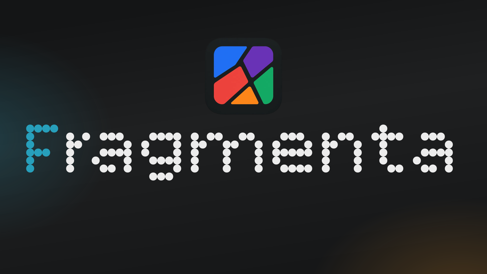

<div align="center">

# Fragmenta Desktop (beta)

[](https://opensource.org/licenses/Apache-2.0)
[](https://github.com/MAz-Codes/fragmenta/releases)
[](https://hub.docker.com/r/mazcode/fragmenta)
[](https://www.misaghazimi.com/fragmenta)
[](https://www.python.org/)
[](https://pytorch.org/)



**Open-source text-to-audio fine-tuning and generation for musicians.**

</div>

Fragmenta brings GenAI audio generation to musicians, offering intuitive fine-tuning and generation capabilities powered by [Stable Audio Open](https://huggingface.co/stabilityai/stable-audio-open-1.0) models. 

This is not commercial software for creating high-fidelity songs or samples. Fragmenta is an open-source pipeline created to facilitate the integration of personalised GenAI technology within the musical workflow for musicians and composers — no coding or machine learning knowledge required. It is therefore more suitable for experimental music and sonic arts applications. This approach corresponds to my [Bending the Algorithm](https://www.misaghazimi.com) philosophy that seeks artist-first approaches in AI technology.

---

## Features

- **Desktop app** with lightweight `pywebview` window and pre-built React frontend — no Node.js or npm required
- **Docker support** — run as a web app on any machine (GPU or CPU)
- Audio file processing with automatic dataset creation
- **Bulk auto-annotation** — automatically generate text prompts for your audio files using DSP analysis (Basic) or AI-powered tagging with LAION-CLAP (Rich)
  - **User-defined vocabulary** — customize the CLAP tagger with your own terms for more personalized annotation
- Guided model download and HuggingFace authorisation
- Model availability updates automatically after download — no restart needed
- **Advanced generation settings** — fine-tune generation with CFG scale, seed control, and batch generation
- **Advanced training settings** — customize epochs, learning rate, batch size, checkpoint frequency, and model precision
- Model fine-tuning, checkpoint saving and unwrapping
- **Performance Mode** — 4-voice diffusion sampler for real-time performance with:
  - Independent channel controls (gain, pan, filter, delay, reverb)
  - Per-channel mute/solo functionality
  - Master output with peak metering (dBFS)
  - Model and checkpoint selection
- Text-to-audio generation (1–47 seconds)
- Real-time GPU memory monitoring

---

## Before You Start

| | Detail |
|---|---|
| **NVIDIA GPU** | Inference is fast (~3s for 10s audio) |
| **Apple Silicon** | Works, but slow (~9m for 10s audio on M1) |
| **Models** | The app guides you through downloading; use the larger model for more coherent results |
| **Offline** | After initial setup, everything runs locally — your data stays on your device |
| **Installation** | Fully isolated. Deleting the folder removes everything (except Python 3.11 if auto-installed) |

---

## Option 1: Run on Hugging Face 🤗

To showcase the pipeline, Fragmenta runs on a [Hugging Face Space](https://huggingface.co/spaces/MazCodes/fragmenta) on CPUs. No coding or installations necessary, but generation is very slow. Limited GPU accelerated sessions are available — please get in touch for me to turn these on for you.

## Option 2: Run Locally with Docker

The fastest way to get started locally — no Python installation needed. Using [Docker Desktop](https://www.docker.com/products/docker-desktop/) pull the image from [Docker Hub](https://hub.docker.com/r/mazcode/fragmenta/tags) or use the commands below.

### GPU (NVIDIA)

> **Windows users:** You must run this from the command line (PowerShell or CMD) — Docker Desktop's GUI "Run" button does not pass the GPU flag. After the first run the container will appear in Docker Desktop as normal.

**Windows (PowerShell):**
```powershell
docker run -d -p 5001:5001 --gpus all `
  -v ${PWD}/models:/app/models `
  -v ${PWD}/output:/app/output `
  -v ${PWD}/config:/app/config `
  mazcode/fragmenta:gpu
```

**Linux:**
```bash
docker run -d -p 5001:5001 --gpus all \
  -v ./models:/app/models \
  -v ./output:/app/output \
  -v ./config:/app/config \
  mazcode/fragmenta:gpu
```

Open **http://localhost:5001** in your browser.

### CPU (Mac / Linux / Windows — no GPU required)

**Mac / Linux:**
```bash
docker run -d -p 5001:5001 \
  -v ./models:/app/models \
  -v ./output:/app/output \
  -v ./config:/app/config \
  mazcode/fragmenta:cpu
```

**Windows (PowerShell):**
```powershell
docker run -d -p 5001:5001 `
  -v ${PWD}/models:/app/models `
  -v ${PWD}/output:/app/output `
  -v ${PWD}/config:/app/config `
  mazcode/fragmenta:cpu
```

> **Note:** Audio generation is significantly slower on CPU.

The `-v` volume mounts ensure downloaded models and generated audio persist across container restarts.

---

## Option 3: Run the App Locally

```bash
git clone https://github.com/MAz-Codes/fragmenta.git
cd fragmenta
```

Run the installer for your platform:

```bash
./fragmenta.sh           # Linux
./fragmenta.bat          # Windows
fragmenta.command        # macOS (double-click in Finder, or run from terminal)
```

The installer sets up a Python virtual environment, installs all dependencies, and launches Fragmenta. The first run takes a few minutes; subsequent launches are faster.

### Launching After Installation

Once installed, use the launch scripts to start Fragmenta directly without re-running the full installer:

| Platform | How to launch |
|----------|--------------|
| **Linux** | Double-click `fragmenta.sh` (mark as executable first, or run `./fragmenta.sh` in terminal) |
| **macOS** | Double-click `fragmenta.command` in Finder |
| **Windows** | Double-click `fragmenta.bat` |

---

## Usage

### 0. Download Models & Authenticate

The app guides you through downloading models and authenticating with HuggingFace on first launch.

> **HuggingFace Token Requirement:** The Stable Audio Open models are gated. You must:
> 1. Accept the license on the model page (while logged into your HF account)
> 2. Use a token with **Read access to public gated repositories** enabled
>
> Classic "read" tokens have this by default. Fine-grained tokens require you to **explicitly enable "Read access to public gated repositories"** under repository permissions at [huggingface.co/settings/tokens](https://huggingface.co/settings/tokens).

### 1. Process Audio Files

Upload audio files with text descriptions. The system saves audio and creates training metadata automatically.

### 1b. Auto-Annotate Your Audio (Optional)

If you have a folder of audio files without text descriptions, the **Bulk Annotate** panel can generate prompts for you automatically. Point it at a folder and choose a tier:

| Tier | How it works | Requirements |
|------|-------------|--------------|
| **Basic** | DSP analysis via librosa — extracts tempo (BPM), musical key, brightness, and melodic/percussive character | No download, CPU only |
| **Rich** | Everything in Basic, plus zero-shot genre, mood, and instrument tagging using [LAION-CLAP](https://github.com/LAION-AI/CLAP) | ~2.35 GB one-time model download, GPU recommended |

**User-Defined Vocabulary (Rich tier only):** Customize the CLAP tagger with your own terms to get more personalized annotations. Add terms that match your musical style, domain, or artistic vocabulary for results tailored to your workflow.

Once annotation finishes, results appear in an editable table — you can review and tweak any prompt before saving. Choosing **"Copy files into data/"** moves everything into the dataset folder in one step; **"Leave files in place"** keeps them where they are and references their original paths.

### 2. Train Model

Configure training parameters:

- **Base model:** [Stable Audio Open](https://huggingface.co/stabilityai/stable-audio-open-1.0) Small (341M) or 1.0 (838M)
- **Epochs**, **batch size**, **learning rate**, **checkpoint frequency**, **precision** (auto, fp32, fp16)

> **Important:** You must unwrap your trained model before using it for generation. This can be done on the generation page.

### 3. Generate Audio

Use base or fine-tuned models to generate audio from text prompts (1–47 seconds). After training, select your checkpoint from the dropdown, unwrap it, and generate.

**Advanced Generation Settings:**
- **CFG Scale** — control how closely the model follows your prompt (higher = stricter adherence)
- **Seed** — control randomness; same seed produces identical results
- **Batch generation** — generate multiple variations at once
- **Duration** — 1–10 seconds for small models, 1–47 seconds for larger models

### 4. Performance Mode (Optional)

Enable Performance Mode to use a 4-voice diffusion sampler for near-real-time musical performance and experimentation.

**Performance Mode Features:**
- **4 Independent Channels** — each with:
  - Text prompt input for generation
  - Pan control (stereo positioning)
  - Effect chain: low-pass filter, delay with feedback, reverb
  - Per-channel gain control
  - Mute and solo buttons
  - Waveform visualization
  - Loop toggle
- **Master Output** — control overall level with dBFS metering and peak hold display
- **Model Selection** — choose base or fine-tuned models; maximum duration adjusts automatically based on model size

The Performance Mode is lazy-loaded and only activates when enabled via the toggle in the sidebar.

---

## Project Structure

```
fragmenta/
├── app/
│   ├── backend/            # Flask API server
│   ├── frontend/
│   │   ├── build/          # Pre-built React app (served by Flask)
│   │   └── src/            # React source (only needed for development)
│   └── core/               # Core logic (generation, training, model management)
├── stable-audio-tools/     # Stable Audio library (bundled with some modifications)
├── models/                 # Model configs and checkpoints
├── utils/                  # Utility modules
├── config/                 # Configuration files
├── fragmenta.sh              # Linux — first-time setup + launch
├── fragmenta.bat             # Windows — first-time setup + launch
├── fragmenta.command         # macOS — first-time setup + launch
├── fragmenta.sh         # Linux — launch after installation (double-click)
├── fragmenta.command      # macOS — launch after installation (double-click)
├── fragmenta.bat      # Windows — launch after installation (double-click)
└── start.py                # App entry point (called by launch scripts)
```

---

## Troubleshooting

| Problem | Solution |
|---|---|
| pywebview/GTK error on Linux | Install WebKitGTK/GTK runtime packages, then rerun the installer |
| Flash-Attention won't install | Optional dependency — app works without it. Not available on Windows |
| GPU memory issues | Use the "Free GPU" button or reduce batch size |
| Import errors | Verify Python 3.11 is installed |

---

## License

Copyright 2025-2026 Misagh Azimi

Licensed under the Apache License 2.0 — see [LICENSE](LICENSE) for details.

### Third-Party Software

Fragmenta includes and depends on various third-party open-source software. See [NOTICE.md](NOTICE.md) for complete attribution and license information.

- **pywebview** — BSD License
- **Stable Audio Models** — Subject to Stability AI's model license (review when downloading)
- **stable-audio-tools** — MIT License (included with modifications)
