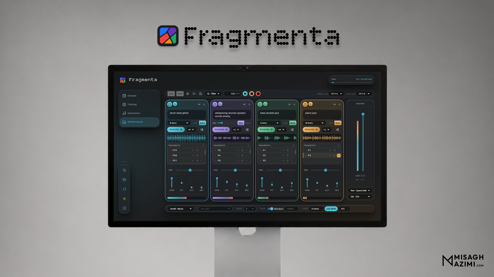
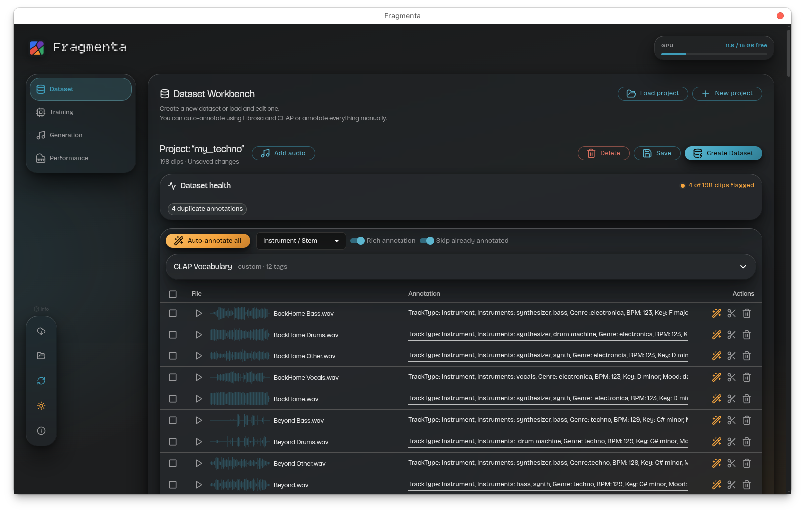
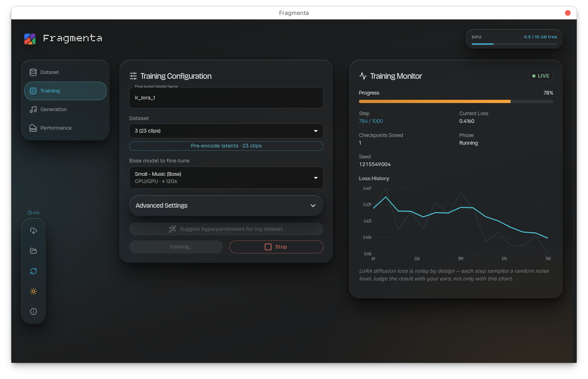
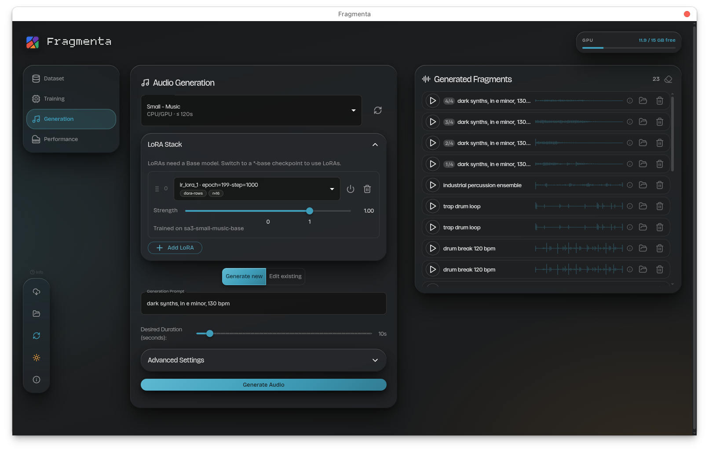
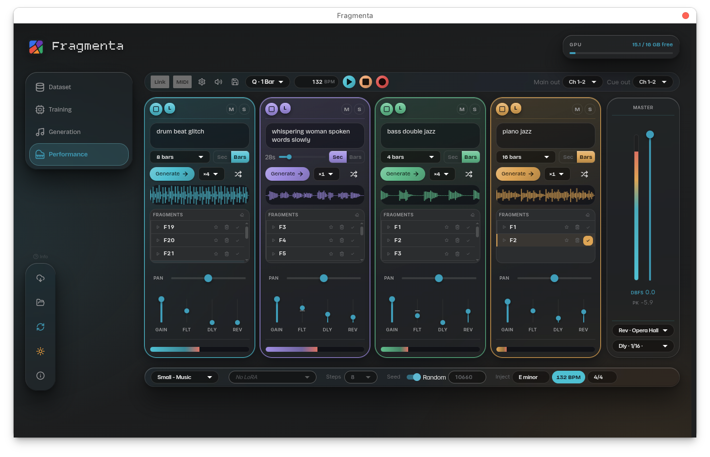

<div align="center">

# Fragmenta 

[](https://www.gnu.org/licenses/agpl-3.0)
[](https://github.com/MAz-Codes/fragmenta/releases)
[](https://hub.docker.com/r/mazcode/fragmenta)
[](https://www.misaghazimi.com/fragmenta)
[](https://www.python.org/)
[](https://pytorch.org/)



**Open-source text-to-audio LoRA training, generation, editing and performance for musicians.**

</div>

Fragmenta offers the complete text-to-audio pipeline to musicians: intuitive dataset creation, LoRA training, generation, audio editing, and a novel live performance capability, all powered by **Stable Audio 3**.

> **Compatibility:** The beta version's engine has been removed; if you need it, use the [`v0.1.x-legacy`](https://github.com/MAz-Codes/fragmenta/releases) tag. 

Fragmenta is an open-source app for bringing personalised text-to-audio GenAI into a meaningful musical workflow with no coding required. It is built mainly with experimental music and sonic arts in mind. Fragmenta reflects the parasitic, small-data, model-bending and artist-first approaches to AI that are fundamental to my [PhD research](https://www.misaghazimi.com).

---

## Features

- **Desktop app** with a lightweight `pywebview` window and a pre-built React frontend
- **Docker images** for GPU and CPU, run as a web app on any machine
- **Bulk auto-annotation** — generate text prompts for your audio files via DSP analysis (Basic) or AI tagging with LAION-CLAP (Rich), with optional user-defined vocabulary
- **Project-aware LoRA training** with configurable rank, steps, learning rate, batch size, checkpoint frequency, and precision — trains directly on a Dataset Workbench project
- **LoRA adapters** — train LoRA, DoRA, or BoRA adapters (plus low-VRAM `-xs` variants) on top of a frozen `*-base` checkpoint for consumer GPUs; stack up to 4 at once with per-slot strength, bypass, and reorder at generation time
- **Text-to-audio generation** — variable-length clips (up to 120s small / 380s medium), with CFG scale, inference steps, seed control, and a multi-LoRA stack
- **Audio editing (Edit tab)** — style transfer (audio-to-audio), region inpainting, and clip extension/continuation
- **Checkpoint Manager** — pick and download individual SA3 checkpoints (Small Music/SFX, Medium, and the matching `*-base` models) with per-item progress and hardware-compatibility hints
- **Performance Mode** — a 4-channel live sampler: per-channel effects (gain, pan, filter, delay, reverb), master dBFS metering, bars-mode generation, launch quantization (standalone or via **Ableton Link**), persistent sessions, named presets, and MIDI learn (see [Performance Mode](#4-performance-mode))
- **Real-time GPU memory monitoring**


---

## Before You Start

Fragmenta runs three ways — pick the one that fits:

| Path | Best for | Needs |
|---|---|---|
| **[Hugging Face Space](#option-1-run-on-hugging-face-)** | A quick look, zero install | A browser (CPU only) |
| **[Docker](#option-2-run-locally-with-docker)** | Running locally, fast setup | Docker (NVIDIA GPU optional) |
| **[Local source](#option-3-run-the-app-locally)** | Development, Apple Silicon | Python 3.11 |

Works on Windows, macOS, and Linux. **Small** Music/SFX models run on CPU, Apple Silicon, or GPU; **Medium** needs an NVIDIA GPU. After a one-time model download everything runs offline and on-device — the in-app **Checkpoint Manager** handles the downloads (see [Authenticate & Download Models](#0-authenticate--download-models)).

---

## Option 1: Run on Hugging Face 🤗

If you only want to get to know the app, Fragmenta runs on a [Hugging Face Space](https://huggingface.co/spaces/MazCodes/fragmenta) on CPUs.

## Option 2: Run Locally with Docker

The fastest way to get started locally — no Python installation needed. Run one of the commands below, then open **http://localhost:5001** in your browser.

```bash
# GPU (NVIDIA)
docker run -d -p 5001:5001 --gpus all -v ./models:/app/models mazcode/fragmenta:gpu

# CPU (Mac / Linux / Windows — slower)
docker run -d -p 5001:5001 -v ./models:/app/models mazcode/fragmenta:cpu
```

For the full volume mounts, Windows/PowerShell syntax, environment variables, and a `docker-compose.yml`, see the **[Docker Hub page](https://hub.docker.com/r/mazcode/fragmenta)**.

---

## Option 3: Run the App Locally

> **Requirements:** Python 3.11 ([download](https://www.python.org/downloads/release/python-3119/)) — newer versions (3.12, 3.13) won't install the dependencies. On **Apple Silicon**, macOS 14 (Sonoma) or newer is required (Fragmenta uses bf16 on the Metal/MPS backend).

```bash
git clone https://github.com/MAz-Codes/fragmenta.git
cd fragmenta
```

Run the installer for your platform:

| Platform | Command |
|---|---|
| **Linux** | `./fragmenta.sh` |
| **macOS** | `fragmenta.command` |
| **Windows** | `./fragmenta.bat` |

The installer verifies Python 3.11 is available, sets up a virtual environment, installs all dependencies, and launches Fragmenta. The first run takes a while; subsequent launches are faster — re-run the same script to start the app. The install is fully isolated: deleting the folder removes everything except Python itself.

---

## Usage

### 0. Authenticate & Download Models 

The app guides you through downloading models and authenticating with HuggingFace.

> **HuggingFace Token Requirement:** the Stable Audio 3 weights are gated. You must:
> 1. Accept their license on the model page (while logged into your HF account).
> 2. Create a classic **Read** token and copy it into Fragmenta.
>

### 1. Dataset


Datasets are built in the **Dataset Workbench** (the *Dataset* tab) — an in-app workspace that takes you from raw audio to a captioned, training-ready dataset without spreadsheets or leaving the app. Everything is scoped to a **project**: a folder of audio clips and their text prompts.

1. **Create or load a project** — start fresh, or reopen an existing one to keep editing.
2. **Add audio** — ingest a folder by **copy** (duplicates the originals, safe) or **symlink** (references them in place, saves disk).
3. **Inspect & slice** — every clip shows a waveform and plays back inline. Slice long files into training-sized segments.
4. **Annotate** — type prompts by hand, or **auto-annotate** every clip (or just selected ones):

   | Tier | Adds | Cost |
   |---|---|---|
   | **Basic** | tempo (BPM) + musical key, via librosa | instant, CPU |
   | **Rich** | Basic + zero-shot genre / mood / instruments via [LAION-CLAP](https://github.com/LAION-AI/CLAP) | ~2.35 GB one-time download |

   A **prompt template** (Music / Instrument / SFX) shapes how the tags are formatted, and the Rich tier's **CLAP vocabulary** is editable so tags match your own taxonomy.
5. **Check & create** — a health strip flags empty or duplicate prompts, sub-1 s clips, and unsupported formats. **Save** keeps a restartable draft; **Create Dataset** writes the final, training-ready form. Optionally **pre-encode latents** here for a 5–10× per-step training speed-up.

The finished project shows up directly in the Training tab — no export step.


### 2. Train


Training produces a **LoRA adapter** against a `*-base` checkpoint (`sa3-small-music-base`, `sa3-small-sfx-base`, or `sa3-medium-base`).

| Base | VRAM (LoRA) | When to pick it |
|---|---|---|
| `sa3-small-*-base` | ~2.5 GB (≈2 GB with `-xs`) | Laptop / consumer GPU; fast iteration |
| `sa3-medium-base` | ~6.5 GB (≈5.5 GB with `bf16`) | Best fidelity; needs an NVIDIA GPU |

Pick a project from the Dataset Workbench, choose an **adapter type** (`dora-rows` is the recommended default), set rank/steps/learning rate, and Start. Each `step_<n>.safetensors` checkpoint appears in the LoRA picker as it's written.


### 3. Generate


Use base or distilled models to generate audio from text prompts — up to 120 s on the Small models, 380 s on Medium. If you've trained a LoRA, pick one and dial in a multiplier to control how strongly the adapter biases the output.

**Settings:**
- **CFG scale** — how closely the model follows your prompt (higher = stricter)
- **Inference steps** — diffusion steps per generation. More = higher quality, proportionally slower. Locked to 8 for the distilled small model.
- **Seed** — control randomness; same seed produces identical results
- **Batch generation** — generate multiple variations at once


### 4. Performance


This is a 4-channel diffusion sampler designed for live performance use. Each channel has its own prompt, generated clip, transport, and effect chain.

**Per-channel controls:**
- Text prompt and Generate (batch 1–4 for variations)
- Gain, pan, bipolar filter (one knob: low-pass below center, high-pass above), delay, reverb
- Mute, solo, loop toggle
- Waveform display and per-channel level meter
- Fragment history — every clip a channel generates is kept; audition it, star to keep, or drag it onto the waveform to load

**Master controls:**
- Master fader with peak-hold dBFS metering
- Play All / Stop All, and Record the master output to WAV
- Master tempo (BPM) — drives bars-mode generation and launch quantization
- Launch quantization (`Q`) — snap launches to the grid (None, 1/32 → 8 Bars)
- Master reverb (selectable impulse response) and tempo-synced delay division
- **Ableton Link** toggle — sync tempo with any Link-enabled app on the local network

**Bars-mode generation:**
Switch a channel from `sec` to `bars` and pick a length (1, 2, 4, 8, or 16 bars). The clip is rendered to that bar count at the master BPM. 

**Launch quantization:**
With `Q` set to anything other than None, channel launches snap to the next quantum on the bar grid. Works standalone via an internal beat clock, or in sync with Ableton Link if enabled. The first launch (when nothing is playing) fires immediately and anchors the transport; subsequent launches snap.

**Sessions and presets:**
- Every panel setting (BPM, knobs, prompts, model choice, etc.) auto-persists, so reloads and tab switches don't lose state.
- Click the floppy-disk icon in the toolbar to save the current configuration as a named preset, or load a saved one. **Restore defaults** wipes the session and MIDI mappings if you want to start clean.

**MIDI:**
Click **MIDI** in the toolbar to enter learn mode, then click any UI element and move a hardware knob/button to bind it. Mappings persist across sessions.

**Other:**
- **Prompt injection** — optional toggles append the master tempo (BPM), a prompt key, and a time signature to each prompt (BPM is skipped if the prompt already names one). Set from the bottom bar.
- **Shared inference steps and seed** with the Generation page.


---

## Stats

Real generation times measured in Fragmenta — **full clip** (sampling + VAE decode), warm model, batch size 1. Yours will vary with hardware, prompt, and settings.

**Test machines:** NVIDIA RTX 5080 · AMD Ryzen 5 7600 (CPU, 12 threads) · Apple M1 (8-core)

**Models:** *Small* = Music **or** SFX (same 433M architecture, near-identical speed; up to 120 s). *Medium* = 1.4B, NVIDIA GPU only (requires Flash Attention 2; up to 380 s). All values in **seconds**.

### Small (Music / SFX)

| Device | Inference steps | 10 s | 30 s | 60 s | 120 s |
|---|---|---|---|---|---|
| **GPU** (RTX 5080) | 8 (distilled) | 0.3 | 0.3 | 0.3 | 0.4 |
| **GPU** (RTX 5080) | 50 (base) | 1.4 | 1.4 | 1.6 | 2.7 |
| **GPU** (RTX 5080) | 250 (base) | 6.7 | 6.6 | 7.5 | 12.5 |
| **CPU** (Ryzen 5 7600) | 8 (distilled) | 4.7 | 8.3 | 14.7 | 27.1 |
| **CPU** (Ryzen 5 7600) | 50 (base) | 40.0 | 74.6 | 139.1 | 277.0 |
| **CPU** (Ryzen 5 7600) | 250 (base) | 197.4 | 402.9 | 691.5 | 1301.3 |
| **CPU** (Apple M1) | 8 (distilled) | 5.6 | 8.9 | 14.1 | 27.8 |
| **CPU** (Apple M1) | 50 (base) | 43.0 | 83.9 | 134.9 | 548.1 |
| **CPU** (Apple M1) | 250 (base) | 210.7 | 398.5 | 668.3 | 2515.9 |

### Medium (GPU only)

| Inference steps | Device | 10 s | 30 s | 60 s | 120 s | 250 s | 380 s |
|---|---|---|---|---|---|---|---|
| 8 (distilled) | **GPU** (RTX 5080) | 0.4 | 0.5 | 0.6 | 1.1 | 2.3 | 5.7 |
| 50 (base) | **GPU** (RTX 5080) | 2.0 | 2.9 | 4.3 | 8.1 | 18.6 | 29.5 |
| 250 (base) | **GPU** (RTX 5080) | 9.9 | 13.7 | 19.9 | 39 | 90 | 143 |

---

## Project Structure

```
fragmenta/
├── app/
│   ├── backend/            # Flask API server
│   ├── frontend/
│   │   ├── build/          # Pre-built React app (served by Flask)
│   │   └── src/            # React source (only needed for development)
│   └── core/               # Core logic (generation, training, model management)
├── vendor/                 # Bundled third-party code
│   └── stable-audio-3/     # Stable Audio 3 (pinned snapshot; see UPSTREAM.md)
├── models/                 # Model configs and checkpoints
├── utils/                  # Utility modules
├── config/                 # Configuration files
├── fragmenta.sh            # Linux — first-time setup and subsequent launches
├── fragmenta.bat           # Windows — first-time setup and subsequent launches
├── fragmenta.command       # macOS — first-time setup and subsequent launches
└── start.py                # App entry point (called by launch scripts)
```

---

## Troubleshooting

| Problem | Solution |
|---|---|
| pywebview / GTK error on Linux | Install WebKitGTK / GTK runtime packages, then rerun the installer |
| Flash-Attention won't install | Small models run without it; **Medium requires it** (NVIDIA GPU). On Windows, install the prebuilt wheel provided with the project |
| GPU memory issues | Use the **Free GPU** button in the header, or reduce batch size |
| Performance panel feels stuck or its state is wrong | Open the preset menu and click **Restore defaults** |
| Import errors | Verify Python 3.11 is installed — newer versions are not supported. [Download Python 3.11.9](https://www.python.org/downloads/release/python-3119/). If you previously ran the installer with the wrong Python version, delete the `venv/` folder and rerun. |

---

## License

Copyright 2025-2026 Misagh Azimi

Licensed under the **GNU Affero General Public License v3.0** — see [LICENSE](LICENSE) for the full text.

**What this means in practice:**
- You can use, study, modify, and redistribute Fragmenta freely.
- If you distribute Fragmenta (modified or not), or **run a modified version as a hosted/network service**, you must release your source code under the same AGPL-3.0 license.
- You must keep the copyright notice and attribution.

If you want to use Fragmenta under different terms (e.g. embedded in a closed-source commercial product), please reach out — as the sole copyright holder I'm open to discussing alternative licensing.

### Third-Party Software

Fragmenta is **Powered by Stability AI**, using the [Stable Audio 3](https://github.com/Stability-AI/stable-audio-3) model family.

> "This Stability AI Model is licensed under the Stability AI Community License, Copyright © Stability AI Ltd. All Rights Reserved"

- **Vendored code** — the Stable Audio 3 inference/training code is bundled under [`vendor/stable-audio-3/`](vendor/stable-audio-3/) (pinned snapshot; see [UPSTREAM.md](vendor/stable-audio-3/UPSTREAM.md)) under the **MIT License**, © 2026 Stability AI — see [vendor/stable-audio-3/LICENSE](vendor/stable-audio-3/LICENSE).
- **Model weights** — **not** redistributed with Fragmenta; you download them from Hugging Face and accept their license then. Governed by the **[Stability AI Community License](https://stability.ai/community-license-agreement)** (free use up to USD $1M annual revenue; above that an enterprise license from Stability AI is required), and they include a T5Gemma text encoder under the **[Gemma Terms of Use](https://ai.google.dev/gemma/terms)**. LoRA adapters you train on the `*-base` checkpoints are Derivative Works under the same Community License.

Fragmenta also depends on many open-source libraries. See [NOTICE.md](NOTICE.md) for the complete attribution and license list.
